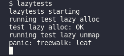

# Lab 5 lazy

## 实验目的

这一章节设置了一个lazy技巧。考虑到系统释放物理内存耗费时间较多，且部分程序allocate的内存往往大于其实际需求，因此在设计sbrk()时，并没有直接释放物理内存，而只是记录用户地址，并将其标为非法，直到进程首次尝试使用时，CPU产生一个page fault，内核再释放内存。

## 实验步骤

### Eliminate allocation from sbrk()

直接删除sbrk()中的释放内存代码段，改为增加myproc()->sz。

相关代码在kernel/sysproc.c中

```c
  if(argint(0, &n) < 0)
    return -1;
  addr = myproc()->sz;
  // if(growproc(n) < 0)
  //   return -1;
  // return addr;

  myproc()->sz += n;
  return addr;
```

### Lazy allocation && Lazytests and Usertests

根据提示来做就好，另外6.S081对应的视频课程中对这部分代码做出了很大一部分的解答。

根据hints，`r_scause() == 13 or 15`表示一个page fault，同时`r_stval`返回导致page fault的虚拟地址。

（这部分的源头在[RISC-V privileged instructions](https://github.com/riscv/riscv-isa-manual/releases/download/draft-20200727-8088ba4/riscv-privileged.pdf)中

)

因此，如是修改kernel/trap.c的usertrap

```c
    intr_on();

    syscall();
  } 
  else if (r_scause() == 13 || r_scause() == 15){
    uint64 fault_va = r_stval();
    if (PGROUNDDOWN(p->trapframe->sp) >= fault_va || fault_va >= p->sz){
      p->killed = 1;
    } 
    else {
      char* pa = kalloc();
      if (pa != 0){
        memset(pa, 0, PGSIZE);
        if (mappages(p->pagetable, PGROUNDDOWN(fault_va), PGSIZE, (uint64)pa, PTE_R | PTE_W | PTE_U) != 0){
          printf("haha\n");
          kfree(pa);
          p->killed = 1;
        }
      }
      else {
        printf("kalloc == 0\n");
        p->killed = 1;
      }
    }
  } else if((which_dev = devintr()) != 0){
    // ok
```

这之中亦对后续tests中的两种情况做了判断，一种是页面地址在用户栈下面，另一种是va地址高于sbrk的地址。此时应kill这个进程。

处理的代码基本参考`uvmalloc`。

避免kernel/vm.c的`uvmunmap`中因为找不到pte或者pte非法panic，需要将这两句注释：

```c
  for(a = va; a < va + npages*PGSIZE; a += PGSIZE){
    if((pte = walk(pagetable, a, 0)) == 0)
      // panic("uvmunmap: walk");
      continue;
    if((*pte & PTE_V) == 0)
      // panic("uvmunmap: not mapped");
      continue;
    if(PTE_FLAGS(*pte) == PTE_V)
      panic("uvmunmap: not a leaf");
    if(do_free){
```

处理fork函数，可知fork通过`uvmcopy`拷贝页表，处理方式同理

```c
  for(i = 0; i < sz; i += PGSIZE){
    if((pte = walk(old, i, 0)) == 0)
      // panic("uvmcopy: pte should exist");
      continue;
    if((*pte & PTE_V) == 0)
      // panic("uvmcopy: page not present");
      continue;
    pa = PTE2PA(*pte);
    flags = PTE_FLAGS(*pte);
    if((mem = kalloc()) == 0)
```

最后是处理read和write的情况，这两个函数最终会用到copyin和copyout两个函数，而这两个函数最终通过walkaddr函数处理得到物理地址，因此修改原先逻辑，当pte无效或不存在时，分配新的物理页：

```c
    return 0;

  pte = walk(pagetable, va, 0);
  if (pte == 0 || (*pte & PTE_V) == 0){
    struct proc *p = myproc();
    if (va >= p->sz || va <= PGROUNDDOWN(p->trapframe->sp))
      return 0;

    char *pa = kalloc();
    if (pa == 0)
      return 0;
    else {
      memset(pa, 0, PGSIZE);
      if (mappages(p->pagetable, PGROUNDDOWN(va), PGSIZE, (uint64)pa, PTE_W | PTE_R | PTE_U) != 0){
        kfree(pa);
        return 0;
      }
    }
  }

  if((*pte & PTE_U) == 0)
    return 0;
  pa = PTE2PA(*pte);
```

记得在kernel/vm.c中提前加入proc的头文件：

```c
#include "defs.h"
#include "fs.h"

#include "spinlock.h"
#include "proc.h"
```

## 实验中遇到的问题及解决办法

做第三个lab的时候碰到了这样一个panic



后来发现是usertrap()写得不对，在遇到参数不符合条件，p->killed已经被设为1的情况时，应该直接跳出这个else if，但是我的if逻辑并没有捋清楚，导致其还是像正常一样进行了后续的操作，导致了panic。后来仔细梳理了if和else的逻辑，确保p被kill之后，直接跳出了这个语段。

## 实验心得

- 这个技巧与xv6没啥关系，倒是之前学到的Linux技巧吧哈哈。例如，我想同时为lab4~6各建立一个文件夹，那么只消这样执行
  ```bash
  mkdir -p ~/Work/xv6_diff/lab{4,5,6}
  ```

-  usertests 某一步失败时，可以直接用 usertests [测试名称] 单独运行某个之前失败过的测试。e.g. usertests stacktest。因为usertest的测试时间还是挺长的

- 位运算。越发感受到c语言中采用位运算的精妙。通过简单的左移右移实现某一位的确认，或是2的次数的乘除；通过&|~等符号进行位运算，用一句代码解决问题，确实很酷


