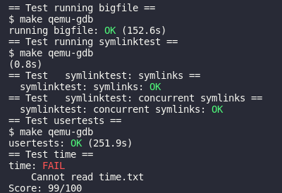

# Lab 9

## 实验目的

该实验与xv6的文件系统相关，主要是实现了两个功能，一是增加了一个二级页表，从而扩充了xv6的文件系统大小；二是实现了软链接

## 实验步骤

### Large files

xv6原先的inode有12个直接索引，和1个一级索引。在此需要将一个直接索引修改为二级索引

就像课本里的inode一样，11个块，1个一级索引，1个二级索引

首先修改and增加几个宏定义，将原先直接访问的12个块改成11个，再定义二级页表，最大文件

```c
#define FSMAGIC 0x10203040

#define NDIRECT 11 // modify
#define NINDIRECT (BSIZE / sizeof(uint))
#define NDINDIRECT (NINDIRECT * NINDIRECT)
#define MAXFILE (NDIRECT + NINDIRECT + NDINDIRECT)
```

由于NDIRECT变了，再修改dinode和inode

```c
// On-disk inode structure
struct dinode {
  short minor;          // Minor device number (T_DEVICE only)
  short nlink;          // Number of links to inode in file system
  uint size;            // Size of file (bytes)
  uint addrs[NDIRECT + 2];   // Data block addresses (add one)
};
// ...
// in-memory copy of an inode
struct inode {
  uint dev;           // Device number
  uint inum;          // Inode number
  int ref;            // Reference count
  struct sleeplock lock; // protects everything below here
  int valid;          // inode has been read from disk?
  short type;         // copy of disk inode
  short major;
  short minor;
  short nlink;
  uint size;
  uint addrs[NDIRECT + 2];
};
```

最后修改bmap，仿照前面页表的寻找方式。记得bread完brelse

```c
  // second level
  bn -= NINDIRECT;
  if (bn < NDINDIRECT){
    if ((addr = ip->addrs[NDIRECT + 1]) == 0)
      ip->addrs[NDIRECT + 1] = addr = balloc(ip->dev);
    bp = bread(ip->dev, addr);
    a = (uint*)bp->data;
    if ((addr = a[bn / NINDIRECT]) == 0){
      a[bn / NINDIRECT] = addr = balloc(ip->dev);
      log_write(bp);
    }
    brelse(bp);

    bp = bread(ip->dev, addr);
    a = (uint*)bp->data;
    if ((addr = a[bn % NINDIRECT]) == 0){
      a[bn % NINDIRECT] = addr = balloc(ip->dev);
      log_write(bp);
    }
    brelse(bp);
    return addr;
  }

  panic("bmap: out of range");
}
```

修改itrunc，确保释放包括两级页表在内的所有块

```c
  struct buf *bp2;
  uint *a2;

  if(ip->addrs[NDIRECT + 1]){
    bp = bread(ip->dev, ip->addrs[NDIRECT + 1]);
    a = (uint*)bp->data;
    for(j = 0; j < NINDIRECT; j++){
      if(a[j]){
        bp2 = bread(ip->dev, a[j]);
        a2 = (uint*)bp2->data;
        for (i = 0; i < NINDIRECT; i++){
          if (a2[i])
            bfree(ip->dev, a2[i]);
        }
        brelse(bp2);
        bfree(ip->dev, a[j]);
        a[j] = 0;
      }
    }
    brelse(bp);
    bfree(ip->dev, ip->addrs[NDIRECT + 1]);
    ip->addrs[NDIRECT + 1] = 0;
  }

  ip->size = 0;
  iupdate(ip);
}
```

### Symbolic links

此处的软链接，类似于Windows的快捷方式，打开时会自动打开指向的文件。

首先，像lab2一样，给symlink添加系统调用

user/usys.pl

```perl
entry("symlink");
```

kernel/syscall.h

```c
#define SYS_symlink 22
```

kernel/syscall.c

```c
extern uint64 sys_uptime(void);
extern uint64 sys_symlink(void);

static uint64 (*syscalls[])(void) = {
[SYS_fork]    sys_fork,
// ..
[SYS_link]    sys_link,
[SYS_mkdir]   sys_mkdir,
[SYS_close]   sys_close,
[SYS_symlink]   sys_symlink,
};
```

实现sym_link，先读取参数，同时开启事务，避免提交出错。新建一个inode并写入相关数据

```c
uint64 sys_symlink(void){
  char path[MAXPATH], target[MAXPATH];
  struct inode *ip;

  if (argstr(0, target, MAXPATH) < 0 || argstr(1, path, MAXPATH) < 0)
    return -1;

  begin_op();
  if ((ip = create(path, T_SYMLINK, 0, 0)) == 0) {
    end_op();
    return -1;
  }

  if (writei(ip, 0, (uint64)target, 0, MAXPATH) < MAXPATH){
    iunlockput(ip);
    end_op();
    return -1;
  }

  iunlockput(ip);
  end_op();
  return 0;
} 
```

接下来，在kernel/stat.h中增加T_SYMLINK新类型

```c
#define T_DIR     1   // Directory
#define T_FILE    2   // File
#define T_DEVICE  3   // Device
#define T_SYMLINK 4   // symlink
```

kernel/fcntl.h中添加O_NOFOLLOW

```c
#define O_RDWR    0x002
#define O_CREATE  0x200
#define O_TRUNC   0x400
#define O_NOFOLLOW 0x800
```

修改sys_open，设置最大搜索深度为20，如果到达20次，则说明打开文件失败。

```c
      end_op();
      return -1;
    }
  } 
  else {
    int max_depth = 20, depth = 0;
    while (1) {
      if ((ip = namei(path)) == 0) {
        end_op();
        return -1;
      }
      ilock(ip);
      if (ip->type == T_SYMLINK && (omode & O_NOFOLLOW) == 0) {
        if (++depth > max_depth) {
          iunlockput(ip);
          end_op();
          return -1;
        }
        if (readi(ip, 0, (uint64)path, 0, MAXPATH) < MAXPATH) {
          iunlockput(ip);
          end_op();
          return -1;
        }
        iunlockput(ip);
      }
      else
        break;
    }
  }

  if(ip->type == T_DIR && omode != O_RDONLY){
    iunlockput(ip);
    end_op();
    return -1;
  }

  if(ip->type == T_DEVICE && (ip->major < 0 || ip->major >= NDEV)){
    iunlockput(ip);
    end_op();
```


## 实验中遇到的问题及解决办法

一开始不知道begin_op和end_op是什么，查阅后方知，原来是与磁盘交互时调用系统调用都得先用这两句，联想到了数据库里的事务概念，都是为了避免写到一半突然宕机等情况导致系统被破坏，因此先弄好恢复信息，完全写入后方commmit。

## 实验心得

一开始做得有些囫囵吞枣，只知道inode（因为和Linux上的很类似），但是不知道dinode是什么。查阅后方知，dinode原来是磁盘上缓存块。

另外查阅后发现，xv6的文件系统其实非常复杂（在考试里，可能是进程和内存管理出得比较难），其整个文件系统包括了7层：文件描述符、路径名、目录、inode、日志、缓冲区、磁盘。感慨万分。

