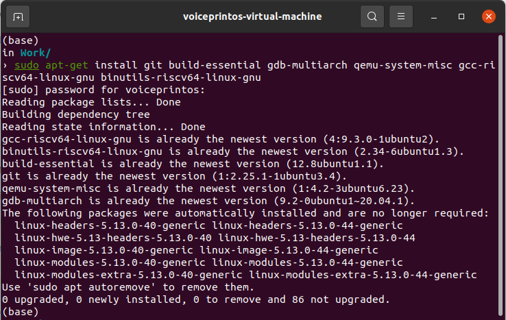

# 前言

大概4月份的时候，初步尝试了xv6的lab，看了两节课，同时做了lab1，后因为时间不足，没有再往下做（截图为证）：


考虑到之前做的实验，内容已经忘得差不多，也没有正规地写过报告，加之托管在GitHub上的记录有些云里雾里的，因此决定重新再来一遍。希望在学完本学期课程的基础上，能有更多的收获。

相关信息：

- [Lab链接](https://pdos.csail.mit.edu/6.828/2020/schedule.html)（2020 Fall 6.S081）
- [本人GitHub代码托管](https://github.com/Baokker/my_xv6_lab)
- 系统：Ubuntu 20.04（运行于VMware Workstation）
- 已将实验代码部分（即本人在每次实验中改动的代码段）以`git diff`的方式输出，并push到master分支上（例，`git diff HEAD^ HEAD > lab1.txt`）

# Tools&Guidance

## 实验目的

这部分主要是介绍在各种操作系统中安装并运行xv6的方法。

由于本人在Ubuntu上运行代码，故只介绍相关内容。

## 实验步骤

1. （Tools部分）通过`apt`包管理，安装所需工具：

   ```bash
   sudo apt-get install git build-essential gdb-multiarch qemu-system-misc gcc-riscv64-linux-gnu binutils-riscv64-linux-gnu 
   ```

   

   若报错，则需要安装一个较老的版本：

   ```bash
   sudo apt-get remove qemu-system-misc
   sudo apt-get install qemu-system-misc=1:4.2-3ubuntu6
   ```

2. 测试是否安装完成

   ```bash
   riscv64-unknown-elf-gcc --version
   qemu-system-riscv64 --version
   ```

   

3. （Guidance部分）gdb见后面实验介绍

## 实验中遇到的问题及解决办法

之前在学校里帮室友看怎么安装xv6相关工具，未曾想后来他跟我说，编译了一晚上还没好。查看以后发现，他一直在处理这一部分


实际上，如果Linux的版本在Debian、Ubuntu或Arch的话，直接按之前的教程，几句命令就搞定了，这一部分是特殊情况（例如，所使用的Linux版本里没有riscv的工具，需要自己手动编译）才会用到的。

## 实验心得

- 对Linux的命令行有一定了解和实操，对git的流程有一定的认识，对完成本项目大有裨益（对未来开发也是）